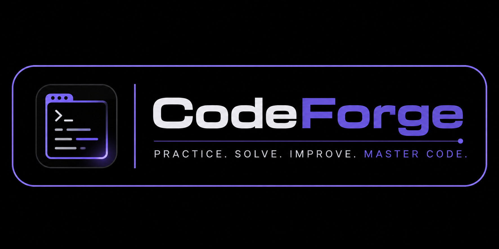

# CodeForge — Online Coding Platform

<!-- Update the path below if your logo filename differs -->
<p align="center">
  
</p>

<p align="center">
  
  
  
  
  
</p>

CodeForge is a **LeetCode-style coding practice platform** where you can browse problems, solve them in an in-browser editor, and **Run**/**Submit** solutions against test cases.

- **Practice flow**: problems list → open a problem → write code → run against public tests → submit against all tests → view submissions
- **Admin flow**: create/edit problems, add public/private test cases, and set starter code per language
- **Tech**:
  - **Frontend**: static HTML/CSS/JS (served by the backend)
  - **Backend**: FastAPI + MongoDB
  - **Judge**: executes code in **Python / JavaScript / Java / C++**

---

### Project structure

```text
.
├─ backend/                 # FastAPI app + API, DB access, judge
│  ├─ main.py               # App entrypoint
│  ├─ core/                 # config + database
│  ├─ models/               # pydantic schemas
│  ├─ routers/              # API routes (/api/...)
│  └─ services/             # business logic + code executor
├─ frontend/                # Static UI served by backend
│  ├─ index.html
│  ├─ admin.html
│  ├─ problem.html
│  └─ static/
│     ├─ css/
│     └─ js/
├─ Dockerfile               # API + judge toolchains container image
├─ docker-compose.yml       # Runs app + MongoDB
└─ requirements.txt
```

---

### Requirements (recommended: Docker)

You can run everything with Docker (no local compilers required). If you run locally without Docker, you must install:

- **Python** (to run the API)
- **MongoDB**
- Toolchains for judging: **Node.js**, **JDK (javac/java)**, **g++**

---

### Quickstart (Docker)

1) Start Docker Desktop.

2) From the repo root:

```bash
docker compose up --build
```

3) Open the app:

- **Default URL**: `http://localhost:8080`

By default the compose file maps host port **8080 → container 8000** to avoid clashing with anything already using port 8000.

If you specifically want to use host port 8000, set `HOST_PORT=8000` (and ensure nothing else is listening on 8000):

PowerShell:

```powershell
$env:HOST_PORT=8000
docker compose up --build
```

---

### Local development (without Docker)

1) Create a virtualenv and install dependencies:

```powershell
python -m venv venv
.\venv\Scripts\Activate.ps1
pip install -r requirements.txt
```

2) Configure environment:

- Copy `backend/.env.example` to `backend/.env` and fill values, or rely on defaults in `backend/core/config.py`.

3) Start MongoDB (locally), then start the API:

```powershell
cd backend
python -m uvicorn main:app --reload --host 127.0.0.1 --port 8000
```

4) Open:

- `http://localhost:8000`

---

### Environment variables

The backend reads `backend/.env` (if present). Common settings:

- **MongoDB**
  - `MONGODB_URL` (Docker uses `mongodb://mongo:27017`)
  - `DATABASE_NAME`
- **Admin**
  - `ADMIN_EMAIL`
  - `ADMIN_PASSWORD`
- **Judge limits**
  - `MAX_EXECUTION_TIME`
  - `MAX_MEMORY_MB`
- **Optional toolchain overrides (Windows-friendly)**
  - `PYTHON_EXECUTABLE`
  - `NODE_EXECUTABLE`
  - `GPP_EXECUTABLE`
  - `JAVAC_EXECUTABLE`
  - `JAVA_EXECUTABLE`

---

### API endpoints (high level)

- **Health**: `GET /api/health`
- **Questions**
  - `GET /api/questions`
  - `GET /api/questions/{idOrSlug}`
  - `GET /api/questions/all` (admin)
  - `POST /api/questions` (admin)
  - `PUT /api/questions/{id}` (admin)
  - `DELETE /api/questions/{id}` (admin)
- **Code execution**
  - `POST /api/code/run`
  - `POST /api/code/submit`
  - `GET /api/code/submissions/{questionId}`
- **Admin auth**
  - `POST /api/auth/admin/login`

---

### Troubleshooting

- **Port already allocated (8000)**:
  - Use the default Docker port `http://localhost:8080`, or stop the service using 8000.
  - On Windows you can check with:

```powershell
netstat -ano | findstr :8000
```

- **“Python was not found … Microsoft Store”** (local dev):
  - Install Python from python.org and ensure it’s on PATH, or disable the Microsoft Store app execution alias, or set `PYTHON_EXECUTABLE` in `backend/.env`.

- **Logo not showing**:
  - Ensure your logo file exists at `docs/logo.png`.
  - If your logo has a different name (e.g. `docs/logo.svg`), update the `` path at the top of this README.
